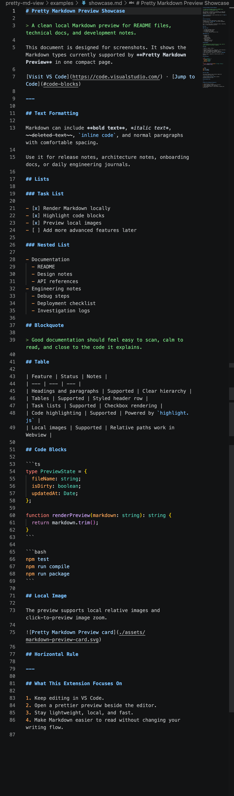
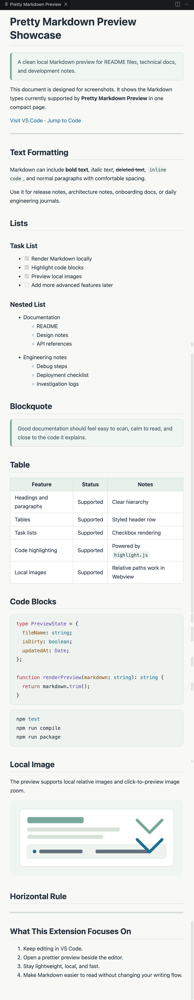

# Pretty Markdown Preview

## 中文说明

Pretty Markdown Preview 是一个轻量的 VS Code Markdown 美化预览插件。

它不会替换 VS Code 自带的 Markdown 编辑器，也不会接管默认预览。你仍然在左侧用普通 Markdown 文件写内容，插件会在右侧打开一个独立的 Webview 预览面板，让文档看起来更清爽、更适合阅读。

适合用来预览：

- README
- 技术文档
- 开发笔记
- 本地 Markdown 草稿

### 效果展示

下面左侧是 Markdown 源文件，右侧是 Pretty Markdown Preview 渲染后的预览效果。

<table>
  <tr>
    <td width="50%" align="center"><strong>Markdown 源文件</strong></td>
    <td width="50%" align="center"><strong>预览效果</strong></td>
  </tr>
  <tr>
    <td width="50%"></td>
    <td width="50%"></td>
  </tr>
</table>

### 主要功能

- 在编辑器旁边打开美化 Markdown 预览。
- 支持标题、段落、加粗、列表、任务列表、表格、引用、链接、图片和代码块。
- 使用 `highlight.js` 高亮代码块。
- 支持本地相对路径图片，例如 `./assets/a.png`。
- 支持点击图片放大预览。
- 编辑 Markdown 后自动刷新预览。
- 提供命令面板入口和 Markdown 编辑器右键菜单入口。

### 安装使用

如果你已经有打包好的 `.vsix` 文件，可以直接安装：

```bash
code --install-extension pretty-md-view-0.0.1.vsix
```

也可以在 VS Code 里安装：

1. 打开 VS Code。
2. 按 `Cmd + Shift + P`。
3. 输入 `Extensions: Install from VSIX...`。
4. 选择 `pretty-md-view-0.0.1.vsix`。

### 使用方式

1. 在 VS Code 中打开一个 `.md` 文件。
2. 按 `Cmd + Shift + P` 打开命令面板。
3. 输入并执行 `Pretty Markdown Preview: Open Preview`。
4. 右侧会打开美化后的 Markdown 预览。

你也可以在 Markdown 编辑器里右键，选择 `Pretty Markdown Preview: Open Preview`。

### 本地开发

安装依赖：

```bash
npm install
```

运行测试和编译：

```bash
npm test
npm run compile
```

在 VS Code 中调试插件：

1. 用 VS Code 打开本项目目录。
2. 进入 Run and Debug 面板。
3. 选择 `Run Extension`。
4. 启动后会打开 Extension Development Host 窗口。
5. 在新窗口中打开 `examples/sample.md`。
6. 执行 `Pretty Markdown Preview: Open Preview`。

### 打包插件

生成本地 VSIX 安装包：

```bash
npm run package
```

打包成功后会生成类似这样的文件：

```text
pretty-md-view-0.0.1.vsix
```

这个 `.vsix` 文件可以发给别人安装，也可以自己本地安装使用。

### 当前范围

当前版本聚焦本地 Markdown 美化预览。暂不包含：

- Mermaid
- 数学公式
- HTML/PDF 导出
- 主题切换
- 同步滚动
- Typora 式所见即所得编辑

## English

Pretty Markdown Preview is a lightweight VS Code extension for a cleaner Markdown preview experience.

It does not replace VS Code's built-in Markdown editor or take over the default preview. You keep editing normal Markdown files, and the extension opens a separate Webview preview beside the editor.

It is useful for:

- README files
- Technical documentation
- Development notes
- Local Markdown drafts

### Preview

The left side shows the Markdown source file. The right side shows the rendered Pretty Markdown Preview output.

<table>
  <tr>
    <td width="50%" align="center"><strong>Markdown Source</strong></td>
    <td width="50%" align="center"><strong>Rendered Preview</strong></td>
  </tr>
  <tr>
    <td width="50%"></td>
    <td width="50%"></td>
  </tr>
</table>

### Features

- Opens a custom Markdown preview beside the editor.
- Supports headings, paragraphs, bold text, lists, task lists, tables, blockquotes, links, images, and code blocks.
- Highlights fenced code blocks with `highlight.js`.
- Supports local relative image paths such as `./assets/a.png`.
- Supports click-to-preview images in an overlay.
- Refreshes automatically after Markdown edits.
- Provides both Command Palette and Markdown editor context menu entries.

### Install

If you already have the packaged `.vsix` file, install it with:

```bash
code --install-extension pretty-md-view-0.0.1.vsix
```

You can also install it from VS Code:

1. Open VS Code.
2. Press `Cmd + Shift + P`.
3. Run `Extensions: Install from VSIX...`.
4. Select `pretty-md-view-0.0.1.vsix`.

### Usage

1. Open a `.md` file in VS Code.
2. Open the Command Palette with `Cmd + Shift + P`.
3. Run `Pretty Markdown Preview: Open Preview`.
4. A prettier Markdown preview opens beside the editor.

You can also right-click inside a Markdown editor and choose `Pretty Markdown Preview: Open Preview`.

### Local Development

Install dependencies:

```bash
npm install
```

Run tests and compile:

```bash
npm test
npm run compile
```

Debug the extension in VS Code:

1. Open this project folder in VS Code.
2. Go to Run and Debug.
3. Select `Run Extension`.
4. VS Code opens an Extension Development Host window.
5. Open `examples/sample.md` in that new window.
6. Run `Pretty Markdown Preview: Open Preview`.

### Package

Build a local VSIX package:

```bash
npm run package
```

The command generates a file like:

```text
pretty-md-view-0.0.1.vsix
```

You can share this `.vsix` file with others or install it locally.

### Current Scope

This version focuses on local Markdown preview. It does not include:

- Mermaid
- Math rendering
- HTML/PDF export
- Theme switching
- Synchronized scrolling
- Typora-style WYSIWYG editing
